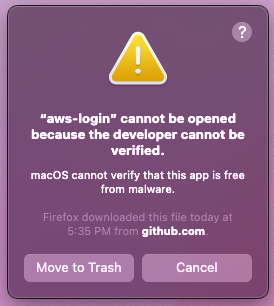
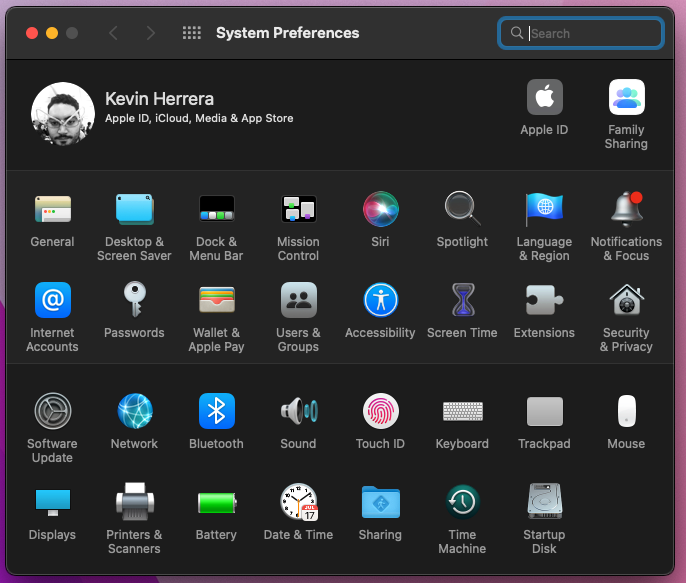
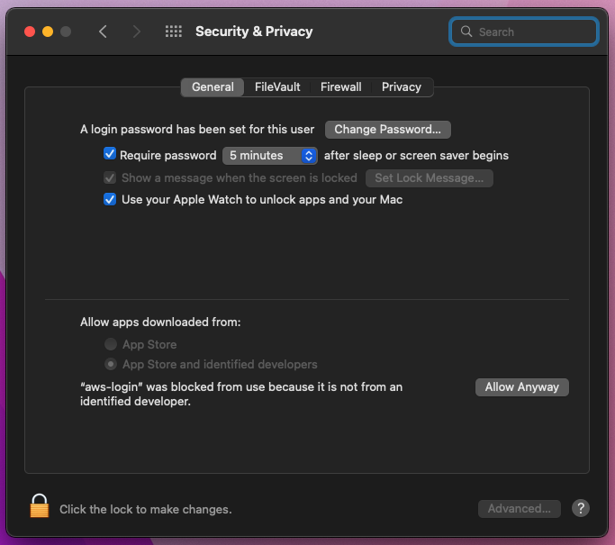
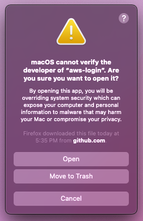

aws-login
=========

A command line utility to simplify logging into AWS accounts and services.

```
$ aws-login use
? Please select a profile to use: ›
❯ dev-read
  dev-write

$ echo $AWS_PROFILE
dev-read

$ aws-login use --profile dev-write

$ echo $AWS_PROFILE
dev-write
```

Table of Contents
-----------------

- [Requirements](#requirements)
    - [Development](#development)
- [Installation](#installation)
    - [macOS](#macos)
- [Usage](#usage)
    - [Configuring Docker to use ECR](#configuring-docker-to-use-ecr)
    - [Configure `kubectl` to use EKS](#configure-kubectl-to-use-eks)
    - [Log into an AWS account using SSO portal](#log-into-an-aws-account-using-sso-portal)
    - [Setting up and activating AWS CLI profiles](#setting-up-and-activating-aws-cli-profiles)
        - [Working with profile templates](#working-with-profile-templates)
    - [Downloading and installing profile templates](#downloading-and-installing-profile-templates)

Requirements
------------

- AWS CLI v2

### Development

- Rust 1.57

Installation
------------

1. Go to the [Releases] page.
2. Download a release for your OS.
3. Unzip the release.
    - `unzip -j aws-login_linux_amd64.zip`
4. Make `aws-login` executable.
    - `chmod 755 aws-login`
5. Move `aws-login` to somewhere in your `$PATH`.
6. Run `aws-login shell install -s $SHELL`, where `$SHELL` is your supported shell.
    - See `aws-login shell --help` for a list of supported shells.
7. Start a new shell session.

[Releases]: https://github.com/kherge/rs.aws-login/releases/latest

### macOS

On more recent versions of macOS, Gatekeeper will block your attempt to run the application because it is not signed with an Apple Developer certificate. I have no intention of paying for the fee any time soon, so you can install the application using Cargo (`cargo install aws-login`), build the application from source (`cargo build --release`), or follow this guide:

1. Run the application.
2. Click **Cancel** in this dialog.<br/>
3. Go to **System Preferences**.<br/>
4. Go to **Security & Privacy**.
5. You should see a message stating that `"aws-login" was blocked from use because it is not from an identified developer.` Click **Allow Anyway**.<br/>
5. Run the application again.
6. Click **Open** in this dialog.<br/>
7. (Optional) Submit [feedback to Apple] to support code signing for FOSS developers.

You only have to do this once per installation or update.

[feedback to Apple]: https://www.apple.com/feedback/macos.html

Usage
-----

Before we dive into using the application, you need to be aware of how profiles work with the AWS CLI. The official AWS CLI supports the use of profiles so that information such as accounts, roles, and preferences are remembered. This saves you from having to provide that information each time you want to do something.

The `aws-login` utility attempts to take full advantage of AWS CLI profiles. When "active AWS CLI profile" is mentioned, it means one of two things:

- The value of the `AWS_PROFILE` environment variable.
- Or "default".

By default, everything you do with `aws-login` will use the profile found in one of the places mentioned above and in the order they are listed. However, like AWS CLI, you can change the profile you are working with by using the `--profile` option.

### Configuring Docker to use ECR

    aws-login ecr

This subcommand will configure Docker to use the Elastic Container Registry in the AWS account for your active AWS CLI profile. If the region for your ECR differs from the default region configured for your profile, remember to specify it with the `--region` option.

### Configure `kubectl` to use EKS

    aws-login eks

This subcommand will prompt you to choose an EKS cluster from a list found in the AWS account for your active AWS CLI profile. Once a selection is made, the configuration for `kubectl` is updated to support connecting to that EKS cluster. Remember to log in before attempting to do so, fresh credentials may be required.

### Log into an AWS account using AWS SSO portal

    aws-login sso

This subcommand will use the AWS SSO portal settings in your active AWS CLI profile for authentication. If the required settings are missing, you will be prompted to provide them before authentication can proceed.

### Setting up and activating AWS CLI profiles

    aws-login use

This subcommand will prompt you to selected from a list of existing AWS CLI profiles and available profile templates. If a profile template is selected and a corresponding AWS CLI profile does not already exist, it will be automatically configured using the template. Once a selection has been made, the shell environment is modified to make it the active AWS CLI profile for the duration of the shell session.

#### Working with profile templates

The `use` subcommand does not simply offer you the ability to select existing AWS CLI profiles, but also offers the ability to use profile templates to configure new AWS CLI profiles. These templates are stored in JSON file called `templates.json` (found in `~/.config/aws-login/` or `%APPDATA\Roaming\AWS Login\`).

This is what a collection of profile templates looks like:

```json
{
    "base": {
        "enabled": false,
        "settings": {
            "output": "json",
            "region": "us-east-1",
            "sso_region": "us-east-1",
            "sso_start_url": "https://my-sso-portal.awsapps.com/start"
        }
    },
    "dev-read": {
        "extends": "base",
        "settings": {
            "sso_account_id": 123456789012,
            "sso_role_name": "ReadOnly"
        }
    },
    "dev-write": {
        "extends": "dev-read",
        "settings": {
            "sso_role_name": "Developer"
        }
    }
}
```

The `base` profile template serves as the foundation for other templates to build upon. It provides some common settings such as where the SSO portal is located. Because this is not a fully configured profile, and is intended to be used by other templates, `enabled` is set to `false` so that it is not listed as an option to select from when `aws-login use` is run.

The `dev-read` profile template uses the `base` template by specifying it under the `extends` key, and adds its own SSO settings that make it ready to be used for authentication. If `dev-read` provided its own `region`, it would override the `region` set by the base profile.

The `dev-write` profile template demonstrates that your profile dependency tree can go as deep as you need. In this template, we re-use all of the settings from `dev-read` (and consequently, `base`) but override the `sso_role_name` we want to use.

##### Okay, but why?

Here is an example scenario:

You are a new hire at a company that hosts all of their services in AWS. As part of the onboarding process, you work on setting up your workstation so that you can use AWS CLI to interact with the cloud environment. Instead of asking around, searching Confluence/Sharepoint/etc, or figuring it out on your own, you install `aws-login` and run the `pull` subcommand with a URL you were provided.

You now have immediate access to various AWS accounts and services.

### Downloading and installing profile templates

> You may want to familiarize yourself with this first:
> [Setting up and activating AWS CLI profiles](#setting-up-and-activating-aws-cli-profiles)

    aws-login pull https://www.example.com/path/to/templates.json

This subcommand will download a remote profile templates file and store a copy for later use. If a local templates file already exists, you will be asked if you would like to merge with the existing file or replace it.
